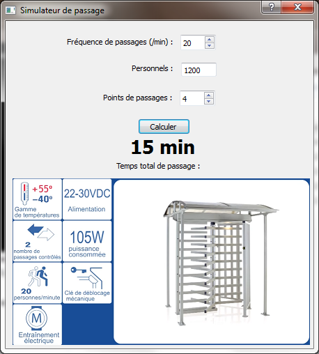

# simulateurPassage
Simulateur de passage par un tourniquet de contrôle d'accès

[openweathermap](http://openweathermap.org/ "http://openweathermap.org/")

* HIM réalisée avec Qt Designer
* Code en python 

